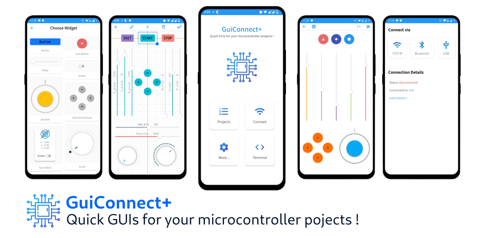

# GuiConnec+ now OpenSourced !

__________

# Demo
* [Demo video for GuiConnect+](https://youtu.be/hOnIKsZdf48)
 
# Tutorials
* [Helper C Library](https://github.com/zakimadaoui/GuiConnectHelper)
* [Getting started with GuiConnect+: blinky example](https://github.com/zakimadaoui/GuiConnectHelper/blob/master/docs/Getting%20started%20with%20GuiConnect%2B.md)
* [Creating custom commands and using constant parameters with a servo robot arm example](https://github.com/zakimadaoui/GuiConnectHelper/blob/master/docs/GuiConnect%2B%20tutorial%20II:%20custom%20commands.md)

